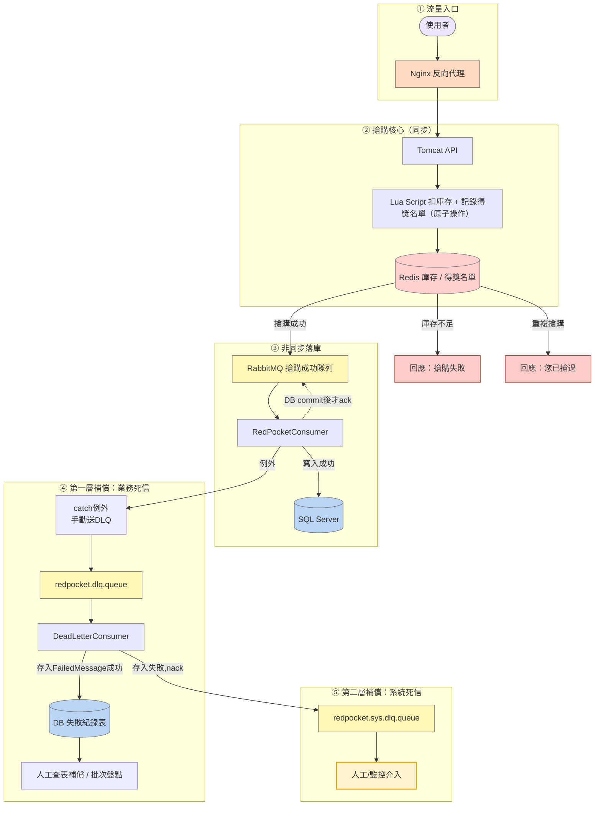

# 高併發搶紅包系統（Red Packet System）

個人 side project，模擬電商／活動場景下的「限量搶購」情境，重點在練習高併發下的**庫存一致性**、**訊息可靠性**與**異常補償機制**設計。

## 系統架構圖

```mermaid
flowchart TB
    subgraph L1["① 流量入口"]
        USER(["使用者"])
        NGINX["Nginx 反向代理"]
    end

    subgraph L2["② 搶購核心（同步）"]
        TOMCAT["Tomcat API"]
        LUA["Lua Script 扣庫存 + 記錄得獎名單（原子操作）"]
        REDIS[("Redis 庫存 / 得獎名單")]
    end

    subgraph L3["③ 非同步落庫"]
        MQ["RabbitMQ 搶購成功隊列"]
        CONSUMER["RedPocketConsumer"]
        DB[("SQL Server")]
    end

    subgraph L4["④ 第一層補償：業務死信"]
        DLQ_SEND["catch例外\n手動送DLQ"]
        DLQ["redpocket.dlq.queue"]
        DLQ_CONSUMER["DeadLetterConsumer"]
        FAILED_TABLE[("DB 失敗紀錄表")]
        ADMIN["人工查表補償 / 批次盤點"]
    end

    subgraph L5["⑤ 第二層補償：系統死信"]
        SYS_DLQ["redpocket.sys.dlq.queue"]
        SYS_ADMIN["人工/監控介入"]
    end

    USER --> NGINX --> TOMCAT --> LUA --> REDIS

    REDIS -->|"搶購成功"| MQ
    REDIS -->|"庫存不足"| FAIL["回應：搶購失敗"]
    REDIS -->|"重複搶購"| DUP["回應：您已搶過"]

    MQ --> CONSUMER
    CONSUMER -->|"寫入成功"| DB
    CONSUMER -.->|"DB commit後才ack"| MQ
    CONSUMER -->|"例外"| DLQ_SEND --> DLQ

    DLQ --> DLQ_CONSUMER
    DLQ_CONSUMER -->|"存入FailedMessage成功"| FAILED_TABLE --> ADMIN
    DLQ_CONSUMER -->|"存入失敗,nack"| SYS_DLQ --> SYS_ADMIN

    classDef client fill:#eee6ff,stroke:#777
    classDef gateway fill:#ffd8c2,stroke:#777
    classDef service fill:#e8e8ff,stroke:#777
    classDef cache fill:#ffd0d0,stroke:#777
    classDef queue fill:#fff7b8,stroke:#777
    classDef database fill:#b9d4f5,stroke:#777
    classDef error fill:#ffcccc,stroke:#c0392b
    classDef warning fill:#fff3cd,stroke:#e0a800,stroke-width:2px

    class USER client
    class NGINX gateway
    class TOMCAT,LUA,CONSUMER,DLQ_CONSUMER service
    class REDIS cache
    class MQ,DLQ,SYS_DLQ queue
    class DB,FAILED_TABLE database
    class FAIL,DUP error
    class SYS_ADMIN warning
```
